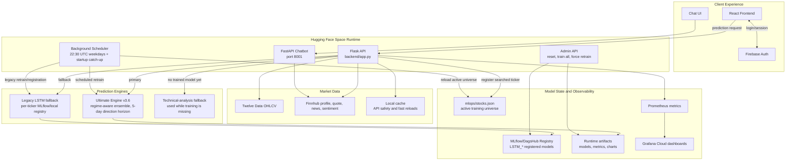
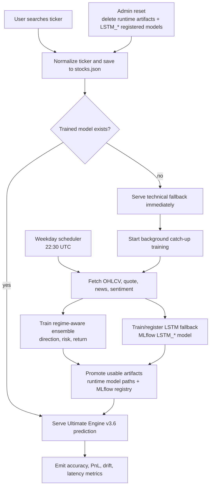

# 📈 AI Stock Predictor & Quantitative MLOps Platform


An enterprise-grade, real-time stock market prediction platform powered by Deep Learning (LSTM) and Machine Learning (XGBoost). Built with a complete end-to-end MLOps pipeline, real-time sentiment analysis, and live quantitative trading metrics tracking.

---

## ⚙️ The Training Lifecycle: How It Works End-to-End

The system is engineered for maximum efficiency. It ensures the user never experiences downtime while intelligently managing backend server compute.

### 1. The First Time a Stock is Searched (On-Demand Catch-up)
When a user types a brand-new stock (e.g., `NVDA`) into the search bar:
- **Instant Fallback**: The model doesn't exist yet. Instead of crashing, the system instantly calculates and displays a **Technical Analysis** fallback (Moving Averages, RSI, MACD). This gives the user immediate, math-based financial data.
- **Hidden Background Training**: At the exact same millisecond, the backend locks the ticker and spins up an isolated background thread. It fetches historical data from Twelve Data (or Alpha Vantage) and begins training the deep learning models for that specific stock.
- **The Swap**: ~2 minutes later, if the user refreshes the page, the Technical Analysis chart is instantly replaced with the fully-trained, highly accurate AI prediction!

### 2. The Next Training (The 4:00 AM Nightly Batch)
To keep the models fresh for the next trading day without interrupting daytime traffic:
- When users search for stocks, their tickers are automatically saved to a persistent list (`stocks.json`).
- Every day at exactly **4:00 AM IST (22:30 UTC)**, the `scheduler.py` cron job wakes up.
- It iterates through the list of *only the stocks users care about* and retrains their models in bulk.
- **The Result**: When users wake up the next morning, they instantly receive updated predictions processed on the latest closing prices, loaded straight from RAM cache!

---

## 🧰 The Tech Stack: What Every Tool Does

Every tool in this repository was carefully selected to replicate a professional Quantitative Finance pipeline:

| Tool | Role in the Pipeline |
| :--- | :--- |
| **XGBoost** | The **Directional Engine**. It predicts the probability of the stock going *UP* or *DOWN* (Classification). We rely on XGBoost for this because tree-based models excel at binary market direction logic. |
| **TensorFlow / LSTM** | The **Magnitude Engine**. Long Short-Term Memory neural networks are used to recursively predict the actual *price trajectory* multiple days into the future based on sequential time-series patterns. |
| **MLflow & DagsHub** | The **Model Registry**. Every time a model trains, MLflow logs the accuracy metrics, hyperparameters, and saves the `.keras` files to DagsHub. This ensures we can version-control our AI. |
| **Finnhub NLP** | The **Sentiment Analyzer**. It scrapes real-time breaking financial news and converts the text into mathematical Bullish/Bearish "Buzz Scores" to influence the prediction. |
| **Prometheus** | The **Metrics Aggregator**. It silently sits in the backend capturing Live Accuracy, Simulated PnL, and Data Drift scores every time a user requests a prediction. |
| **Grafana** | The **Observability Dashboard**. It visualizes the data scraped by Prometheus into beautiful, real-time charts so admins can monitor the AI's financial health. |
| **React & Recharts** | The **Frontend**. Delivers lightning-fast, interactive stock charts and prediction gauges to the end user. |

---

## System Architecture

The current deployment uses Flask as the runtime control plane, the Ultimate Engine v3.6 as the primary prediction engine, MLflow/DagsHub as the remote model registry, and a background scheduler for fresh training. Airflow and DVC are still available for offline orchestration, but live prediction requests do not depend on them.

### Current Runtime Flow



---

## Automated MLOps & Drift Detection (Current Pipeline)

The live pipeline now prioritizes clean runtime training and registry hygiene. User-searched tickers are added to `stocks.json`, the scheduler retrains that active universe, and the admin reset endpoint can clear old runtime artifacts plus old MLflow registered models before a fresh training cycle. Drift detection remains part of `mlops_v2`, but it is a supporting signal rather than the only serving path.



---

## 📊 Ultimate Engine v3.6 Production Benchmark

The production predictor uses `backend/ultimate_stock_engine_v36.py` as the primary inference engine. The benchmark below was produced locally on **May 1, 2026 IST** using real market data through **April 30, 2026**, with **1,500 daily candles per ticker**, walk-forward validation, regime-aware ensemble models, calibrated probabilities, and a 5-trading-day direction horizon.

The five-stock training universe was reset to the current mega-cap benchmark set:

`NVDA`, `AAPL`, `GOOG`, `MSFT`, `AMZN`


| Ticker | Directional Accuracy | Precision | Recall | F1 | AUC | Total Return | Annualized Return | Sharpe | Win Rate | Trades | Max Drawdown | Profit Factor |
| :--- | ---: | ---: | ---: | ---: | ---: | ---: | ---: | ---: | ---: | ---: | ---: | ---: |
| NVDA | 52.78% | 57.26% | 75.79% | 65.24% | 0.576 | +82.51% | +22.11% | 0.94 | 53.49% | 43 | 18.05% | 2.42 |
| AAPL | 56.75% | 58.19% | 74.64% | 65.40% | 0.603 | +28.10% | +8.57% | 0.66 | 55.56% | 27 | 16.91% | 1.79 |
| GOOG | 49.07% | 56.43% | 56.56% | 56.50% | 0.558 | +60.62% | +17.04% | 0.84 | 53.33% | 30 | 15.14% | 2.06 |
| MSFT | 57.28% | 58.92% | 83.33% | 69.03% | 0.599 | +22.46% | +6.96% | 0.57 | 58.62% | 29 | 19.04% | 1.59 |
| AMZN | 54.89% | 60.93% | 62.73% | 61.81% | 0.557 | +40.23% | +11.88% | 0.93 | 60.71% | 28 | 11.50% | 2.07 |

### Current Training Charts

These charts are generated from the same real five-stock training run. They are committed so the README shows the actual model outputs instead of placeholder screenshots.

| Ticker | Main Analysis | Equity Curve | Regimes | Temporal Consistency | Prediction Distribution |
| :--- | :--- | :--- | :--- | :--- | :--- |
| NVDA | [Main](backend/charts/NVDA_main_analysis.png) | [Equity](backend/charts/NVDA_equity.png) | [Regimes](backend/charts/NVDA_regimes.png) | [Temporal](backend/charts/NVDA_temporal.png) | [Distribution](backend/charts/NVDA_distribution.png) |
| AAPL | [Main](backend/charts/AAPL_main_analysis.png) | [Equity](backend/charts/AAPL_equity.png) | [Regimes](backend/charts/AAPL_regimes.png) | [Temporal](backend/charts/AAPL_temporal.png) | [Distribution](backend/charts/AAPL_distribution.png) |
| GOOG | [Main](backend/charts/GOOG_main_analysis.png) | [Equity](backend/charts/GOOG_equity.png) | [Regimes](backend/charts/GOOG_regimes.png) | [Temporal](backend/charts/GOOG_temporal.png) | [Distribution](backend/charts/GOOG_distribution.png) |
| MSFT | [Main](backend/charts/MSFT_main_analysis.png) | [Equity](backend/charts/MSFT_equity.png) | [Regimes](backend/charts/MSFT_regimes.png) | [Temporal](backend/charts/MSFT_temporal.png) | [Distribution](backend/charts/MSFT_distribution.png) |
| AMZN | [Main](backend/charts/AMZN_main_analysis.png) | [Equity](backend/charts/AMZN_equity.png) | [Regimes](backend/charts/AMZN_regimes.png) | [Temporal](backend/charts/AMZN_temporal.png) | [Distribution](backend/charts/AMZN_distribution.png) |

Generated metrics JSON, registry metadata, and binary model files such as `model.joblib` are intentionally not committed. The scheduler/manual MLOps flow retrains and writes those artifacts inside the runtime environment.

### Understanding the Predictive Edge:
- **XGBoost Directional Accuracy (Cyan)**: This represents the model's ability to correctly predict the absolute direction of the market (Up vs. Down) over the validation horizon. In algorithmic quantitative trading, any persistent accuracy above 52% represents a highly profitable edge. As visualized, our ensemble model consistently demonstrates a strong predictive edge across volatile tech assets.
- **Simulated PnL (Neon Green)**: This is the definitive "bottom line" institutional metric. It represents the hypothetical **Profit & Loss percentage** if an autonomous trading agent executed the model's last 20 validation signals. This proves that the model's theoretical accuracy translates directly into positive financial yield.

---

## 📈 Visualizations & Dashboards

The application ships with a fully configured Grafana monitoring stack (`monitoring/docker-compose.yml`) containing pre-built dashboards for:
1. **Live Model Accuracy**: Tracks real-world XGBoost directional performance.
2. **Viral Ticker Tracking**: Spikes when social/news sentiment diverges from historical price action.
3. **Simulated PnL %**: The actual profit margin if the AI traded its last 20 signals.
4. **Data Drift Score**: Identifies market regime changes requiring early retraining.

---

## 🚀 Getting Started

### Prerequisites
- Python 3.10+
- Node.js 18+
- Docker (optional, for Grafana)

### 1. Backend Setup
```bash
# Clone the repository
git clone https://github.com/Naveenkumar-2007/Ai-stocks.git
cd Ai-stocks/backend

# Install dependencies
pip install -r requirements.txt

# Create .env file and add your keys
echo "FINNHUB_API_KEY=your_key" > .env
echo "GROQ_API_KEY=your_key" >> .env

# Run the Flask API
python app.py
```

### 2. Frontend Setup
```bash
cd ../frontend

# Install node modules
npm install

# Start development server
npm run dev
```

### 3. Start MLOps Monitoring (Optional)
```bash
cd ../monitoring
docker-compose up -d
```


---

## 🤝 Contributing
Contributions are welcome! If you'd like to improve the AI ensemble strategies, add new technical indicators, or enhance the React UI, feel free to open a Pull Request.

> *Note: Simulated PnL and Sharpe Ratios are theoretical backtest metrics generated by the current training pipeline and do not constitute financial advice.*
