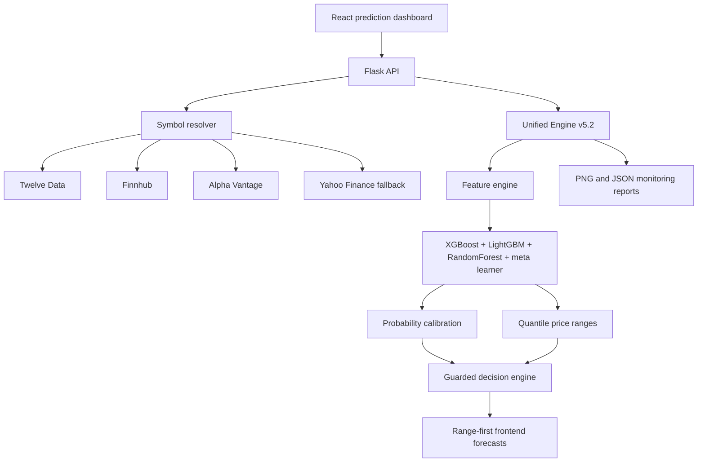

# AI Stock Predictor & MLOps Platform

Production-style stock prediction system with a React dashboard, Flask API, multi-provider market data fallbacks, guarded BUY/HOLD/SELL recommendations, quantile price ranges, and monitoring artifacts generated from walk-forward model validation.

> This project is for research and education. It is not financial advice.

## Current Status

Latest retrain: `2026-05-08`

The current portfolio run trained all 10 configured stocks:

`AAPL`, `MSFT`, `GOOGL`, `AMZN`, `NVDA`, `RELIANCE.NS`, `TCS.NS`, `INFY.NS`, `TSLA`, `META`

Latest aggregate metrics from [multimarket_summary.json](backend/monitoring/reports/multimarket_summary.json):

| Metric | Value |
| --- | ---: |
| Models trained | 10 / 10 |
| Average accuracy | 60.41% |
| Average AUC | 0.614 |
| Average F1 | 46.61% |
| Statistically significant models, p < 0.05 | 7 / 10 |

Latest signal evaluation from [top10_signal_evaluation.json](backend/monitoring/reports/top10_signal_evaluation.json):

| Signal | Stocks |
| --- | --- |
| BUY | AAPL, GOOGL, AMZN, NVDA |
| HOLD | MSFT, TSLA, META, INFY.NS, TCS.NS, RELIANCE.NS |

The guarded decision engine intentionally holds weak, overfit, or low-confidence models instead of forcing aggressive BUY/SELL calls.

## What Is Implemented

- Unified Engine v5.2 model artifacts saved per ticker under `backend/unified_engine/models`.
- Leak-resistant feature selection using train-only windows.
- Walk-forward validation with purge/embargo style time-series evaluation.
- Per-fold scaler fitting to avoid train/test contamination.
- Overfit and underfit diagnostics saved into model metadata.
- Adaptive class weighting for imbalanced directional targets.
- Probability calibration and threshold-aware BUY/HOLD/SELL gating.
- Quantile price ranges for forecast display.
- Volatility-based fallback ranges if quantile outputs are unavailable.
- Frontend forecast table shows price ranges, move ranges, and percent move ranges instead of exact target prices.
- Multi-provider data fallback with API key rotation:
  - Twelve Data
  - Finnhub
  - Alpha Vantage
  - Yahoo Finance fallback for supported symbols
- Indian symbol support:
  - `INFY.NS` maps to Twelve Data `INFY` + `NSE`
  - `TCS.NS` can fall back to Alpha Vantage `TCS.BSE`
  - `RELIANCE.NS` can fall back to Alpha Vantage `RELIANCE.BSE`
- Sentiment is normalized and downweighted when coverage is weak.
- New or untrained stocks enter training mode instead of showing fake predictions.

## Monitoring Artifacts

The latest chart files were generated successfully in `backend/monitoring/reports`.

### Portfolio Charts

- [Combined multi-market monitoring](backend/monitoring/reports/combined_multimarket_monitoring.png)
- [Multi-market heatmap](backend/monitoring/reports/multimarket_heatmap.png)
- [Top 10 signal overview](backend/monitoring/reports/top10_signal_overview.png)
- [Ultimate v5.2 dashboard](backend/monitoring/reports/ultimate_v52_dashboard.png)

### Per-Stock Monitoring Charts

| Stock | Chart | Accuracy | AUC | F1 | p-value | Overfit Risk |
| --- | --- | ---: | ---: | ---: | ---: | --- |
| AAPL | [chart](backend/monitoring/reports/AAPL_monitoring.png) | 65.5% | 0.593 | 79.1% | 0.0000 | medium |
| MSFT | [chart](backend/monitoring/reports/MSFT_monitoring.png) | 47.2% | 0.650 | 0.0% | 0.7965 | high |
| GOOGL | [chart](backend/monitoring/reports/GOOGL_monitoring.png) | 76.7% | 0.619 | 86.8% | 0.0000 | medium |
| AMZN | [chart](backend/monitoring/reports/AMZN_monitoring.png) | 62.8% | 0.734 | 77.1% | 0.0004 | medium |
| NVDA | [chart](backend/monitoring/reports/NVDA_monitoring.png) | 70.4% | 0.549 | 82.6% | 0.0000 | medium |
| RELIANCE.NS | [chart](backend/monitoring/reports/RELIANCE_NS_monitoring.png) | 52.2% | 0.726 | 0.0% | 0.3773 | medium |
| TCS.NS | [chart](backend/monitoring/reports/TCS_NS_monitoring.png) | 65.6% | 0.611 | 0.0% | 0.0014 | high |
| INFY.NS | [chart](backend/monitoring/reports/INFY_NS_monitoring.png) | 56.8% | 0.467 | 71.2% | 0.0413 | high |
| TSLA | [chart](backend/monitoring/reports/TSLA_monitoring.png) | 50.0% | 0.616 | 0.0% | 0.5300 | high |
| META | [chart](backend/monitoring/reports/META_monitoring.png) | 57.1% | 0.574 | 69.3% | 0.0325 | medium |

## Architecture



## Environment Variables

Create `backend/.env`. Do not commit real secrets.

The app supports both singular and plural key variables. The plural variables are preferred because they allow provider key rotation when rate limits are hit.

```env
# Flask
FLASK_ENV=development
SECRET_KEY=replace-with-a-long-random-secret

# Twelve Data
TWELVE_DATA_API_KEYS=key1,key2
TWELVE_DATA_API_KEY=key1

# Alpha Vantage
ALPHA_VANTAGE_API_KEYS=key1,key2,key3
ALPHA_VANTAGE_API_KEY=key1

# Finnhub
FINNHUB_API_KEYS=key1,key2
FINNHUB_API_KEY=key1

# Optional LLM/chatbot key
GROQ_API_KEY=your_key
```

Current local `.env` check:

- `TWELVE_DATA_API_KEYS`: present, 2 keys, no duplicates detected.
- `ALPHA_VANTAGE_API_KEYS`: present, 3 keys, no duplicates detected.
- `FINNHUB_API_KEYS`: present, 2 keys, no duplicates detected.
- Singular fallback keys are also present.
- `SECRET_KEY` was not found and should be added for production.

## Setup

### Backend

```bash
cd backend
pip install -r requirements.txt
python app.py
```

Backend default local URL:

```text
http://localhost:8000
```

### Frontend

```bash
cd frontend
npm install
npm start
```

Frontend default local URL:

```text
http://localhost:3000
```

## Training And Evaluation

Retrain the configured 10-stock portfolio:

```bash
cd backend
python train_top5_monitor.py
```

Evaluate the latest trained models and save signal reports:

```bash
cd backend
python evaluate_top10_models.py
```

Run backend tests:

```bash
python -m pytest backend/tests -q
```

Build the frontend:

```bash
cd frontend
npm run build
```

## Forecast Display Contract

The UI is intentionally range-first:

- No exact price target is shown in the Forecast Signals table.
- Forecast rows show 10th to 90th percentile price range.
- Move range and move percent range are computed from the current price.
- Charts may use the model midpoint internally for drawing continuity, but visible tooltips and tables show ranges.
- If a model is not ready, the app shows training mode and does not display fake forecast prices.

## Known Limitations

- Finnhub blocks some `.NS` Indian stock sentiment/news endpoints with `403` on the current key plan. The decision engine treats this as low-confidence or neutral sentiment instead of forcing sentiment.
- Some models are intentionally conservative because overfit risk is high. This is expected behavior, not a UI bug.
- Alpha Vantage free plans may rate-limit quickly and may not allow `outputsize=full` for some symbols. Multiple keys help, but provider plan limits can still apply.

## Verification Snapshot

Recently verified:

```text
python -m py_compile backend/app.py backend/stock_api.py backend/unified_engine/inference.py
python -m pytest backend/tests -q
npm run build
```

Live endpoint range checks:

```text
AAPL    ready=True   ranges=7/7   invalid_ranges=0
TCS.NS  ready=True   ranges=7/7   invalid_ranges=0
IBM     ready=False  training mode, no fake forecast shown
```
