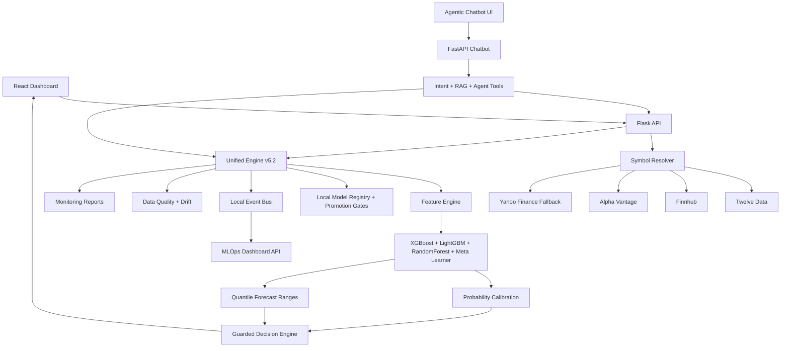

# AI Stock Predictor and MLOps Platform

Datavision is an end-to-end AI/ML stock analysis platform with a React trading dashboard, Flask prediction API, FastAPI agentic chatbot, multi-market data fallbacks, walk-forward model validation, model-quality gates, and monitoring artifacts.

> Research and education only. This project is not financial advice.

## Current Portfolio

Latest portfolio retrain: `2026-05-10`

Configured production watchlist:

`AAPL`, `MSFT`, `GOOGL`, `AMZN`, `NVDA`, `RELIANCE.NS`, `TCS.NS`, `HDFCBANK.NS`, `INFY.NS`, `ICICIBANK.NS`

Latest aggregate metrics from [multimarket_summary.json](backend/monitoring/reports/multimarket_summary.json):

| Metric | Value |
| --- | ---: |
| Models trained | 10 / 10 |
| Average raw accuracy | 62.18% |
| Average balanced accuracy | 50.54% |
| Average AUC | 0.593 |
| Average positive-class F1 | 40.28% |
| Average macro-F1 | 38.92% |
| Statistically significant models, p < 0.05 | 7 / 10 |

Latest signal evaluation from [top10_signal_evaluation.json](backend/monitoring/reports/top10_signal_evaluation.json):

| Signal | Stocks |
| --- | --- |
| BUY | AAPL, GOOGL, NVDA |
| HOLD | MSFT, AMZN, RELIANCE.NS, TCS.NS, HDFCBANK.NS, INFY.NS |
| SELL | ICICIBANK.NS |

The decision engine is intentionally conservative. Weak validation, class imbalance, poor fold stability, or insufficient monitoring history reduces signal strength instead of forcing unrealistic BUY/SELL output.

## Key Features

- React prediction dashboard with dark/light theme support.
- TradingView-style chart workspace with candles, volume, SMA, forecast ranges, signal markers, entry, stop, and targets.
- Range-first forecast display using 10th to 90th percentile price bands.
- AI Watchlist Ranking / Opportunity Radar for comparing multiple stocks.
- Live price, currency, exchange, technical indicators, sentiment, latest news, model trust, risk, and market regime.
- Agentic chatbot that can:
  - answer platform and stock-analysis questions,
  - understand company names and ticker symbols,
  - open the prediction page and visibly operate the search flow,
  - type the ticker, select forecast horizon, click Predict, and show results,
  - open Opportunity Radar for multi-stock comparison,
  - rank watchlists by risk-adjusted ML opportunity score,
  - accept uploaded chart images as context,
  - avoid fake image interpretation when no vision model is available.
- Persistent chat sessions and thumbs-up/thumbs-down learning hooks.
- First-time or untrained stocks show live market analysis and training state instead of fake predictions.
- Reliability monitoring now shows a clear warming-up state until enough completed forecasts mature.

## ML And MLOps

- Unified Engine v5.2 model artifacts per ticker.
- Leak-resistant feature selection using train-only windows.
- Walk-forward validation for time-series evaluation.
- Per-fold scaler fitting to avoid train/test contamination.
- Adaptive class weighting for imbalanced labels.
- Balanced threshold search to reduce one-class prediction collapse.
- Macro-F1, negative-class F1, actual/predicted class rates, AUC, p-value, fold stability, and calibration sample tracking.
- Local model registry code with lifecycle stages:
  - `candidate`
  - `production`
  - `quarantined`
- Promotion gates block statistically weak, unstable, class-collapsed, or poorly calibrated models from being treated as production.
- Guarded decision engine combines ML probability, validation quality, volatility, market regime, sentiment, and risk.
- Monitoring reports are generated as JSON and PNG artifacts.
- Lightweight production MLOps layer for Hugging Face/free hosting:
  - append-only event stream in `backend/monitoring/events`,
  - served prediction audit log in `backend/monitoring/predictions`,
  - OHLCV data-quality checks before inference,
  - return/volume drift monitoring,
  - single API dashboard for model, inference, and event health.

## Architecture



## Monitoring Artifacts

Portfolio reports:

- [Combined multi-market monitoring](backend/monitoring/reports/combined_multimarket_monitoring.png)
- [Multi-market heatmap](backend/monitoring/reports/multimarket_heatmap.png)
- [Top 10 signal overview](backend/monitoring/reports/top10_signal_overview.png)
- [AI forecasting performance monitor](backend/monitoring/reports/ai_stock_forecasting_performance_monitor.png)
- [Ultimate v5.2 dashboard](backend/monitoring/reports/ultimate_v52_dashboard.png)

Per-stock reports:

| Stock | Chart |
| --- | --- |
| AAPL | [chart](backend/monitoring/reports/AAPL_monitoring.png) |
| MSFT | [chart](backend/monitoring/reports/MSFT_monitoring.png) |
| GOOGL | [chart](backend/monitoring/reports/GOOGL_monitoring.png) |
| AMZN | [chart](backend/monitoring/reports/AMZN_monitoring.png) |
| NVDA | [chart](backend/monitoring/reports/NVDA_monitoring.png) |
| RELIANCE.NS | [chart](backend/monitoring/reports/RELIANCE_NS_monitoring.png) |
| TCS.NS | [chart](backend/monitoring/reports/TCS_NS_monitoring.png) |
| HDFCBANK.NS | [chart](backend/monitoring/reports/HDFCBANK_NS_monitoring.png) |
| INFY.NS | [chart](backend/monitoring/reports/INFY_NS_monitoring.png) |
| ICICIBANK.NS | [chart](backend/monitoring/reports/ICICIBANK_NS_monitoring.png) |

## Environment Variables

Create `backend/.env`. Do not commit real secrets.

```env
FLASK_ENV=development
SECRET_KEY=replace-with-a-long-random-secret

TWELVE_DATA_API_KEYS=key1,key2
TWELVE_DATA_API_KEY=key1

ALPHA_VANTAGE_API_KEYS=key1,key2,key3
ALPHA_VANTAGE_API_KEY=key1

FINNHUB_API_KEYS=key1,key2
FINNHUB_API_KEY=key1

GROQ_API_KEY=your_key
```

Plural key variables are preferred because the backend can rotate provider keys when rate limits are hit.

## Local Setup

Backend API:

```bash
cd backend
pip install -r requirements.txt
python app.py
```

Chatbot service:

```bash
cd backend/chatbot/app
python main.py
```

Frontend:

```bash
cd frontend
npm install
npm start
```

Default local URLs:

```text
Frontend: http://localhost:3000
Backend:  http://localhost:8000
Chatbot:  http://localhost:8001
```

## Training And Evaluation

Retrain the configured portfolio:

```bash
cd backend
python train_top5_monitor.py
```

Evaluate latest trained models:

```bash
cd backend
python evaluate_top10_models.py
```

Generate monitoring dashboard:

```bash
cd backend
python create_ultimate_dashboard.py
```

Inspect model registry endpoints:

```text
GET /api/mlops/registry
GET /api/mlops/registry/AAPL
GET /api/mlops/dashboard
GET /api/mlops/dashboard?ticker=AAPL
GET /api/mlops/events
GET /api/mlops/predictions
GET /api/health/training
POST /api/models/train
```

Daily scheduler controls:

```env
DAILY_TRAIN_TIME_UTC=22:30
TRAIN_WEEKDAYS_ONLY=true
ENABLE_STARTUP_CATCHUP=false
SCHEDULER_TRAIN_BATCH_SIZE=20
SCHEDULER_BATCH_SLEEP_SECONDS=10
```

The scheduler writes its latest run summary to:

```text
backend/monitoring/reports/daily_training_summary.json
```

It also publishes MLOps events such as `daily_training_started`, `ticker_training_completed`, `ticker_training_failed`, and `daily_training_completed`.

## Verification

Recent checks:

```bash
python -m py_compile backend/app.py backend/scheduler.py backend/unified_engine/monitoring.py backend/unified_engine/event_bus.py backend/unified_engine/data_quality.py backend/unified_engine/drift_monitor.py backend/unified_engine/prediction_store.py backend/unified_engine/mlops_dashboard.py
python -m py_compile backend/chatbot/app/config.py backend/chatbot/app/main.py backend/chatbot/app/core/agent.py backend/chatbot/app/tools/prediction_tools.py
python -m unittest backend.tests.test_decision_engine backend.tests.test_sentiment_helpers backend.tests.test_training_quality backend.tests.test_model_registry backend.tests.test_lightweight_mlops
cd frontend
npm run build
```

## Forecast Display Contract

- No fake exact target is shown when a model is not ready.
- Forecast tables show ranges instead of pretending certainty.
- New or unsupported stocks show training, retry, or unavailable states.
- Reliability monitoring starts only after enough predictions mature.
- Weak models are held, downweighted, or quarantined instead of forced into BUY/SELL.

## Deployment Notes

Hugging Face Spaces supports Docker deployment for this app, but it does not provide direct Kubernetes control inside a Space. For production-scale deployment, use Kubernetes on AWS, GCP, Azure, or a VPS-backed cluster.

Recommended deployment path:

- Hugging Face Docker Space for public demo.
- Kubernetes for production:
  - frontend service
  - backend API service
  - chatbot service
  - training worker
  - Redis queue
  - Postgres
  - MLflow or model registry
  - Prometheus/Grafana monitoring

## Known Limitations

- Market data provider limits can affect first-time symbols.
- Some Indian-stock news/sentiment endpoints may be unavailable on free API plans.
- Long training jobs are better suited to workers or scheduled jobs than request-time execution.
- Uploaded images are accepted as chat context, but full visual chart interpretation requires adding a vision model.
- Hugging Face Spaces can run this file-backed MLOps layer, but it does not run a real Kafka cluster, Redis cluster, load balancer, or Kubernetes control plane inside the Space.

## Next MLOps Upgrades

- Scheduled retraining with promotion-only deployment.
- Shadow model deployment before production promotion.
- Realized-return evaluation jobs that close the loop on stored predictions.
- Alert rules on the local event stream for data-quality failure, model drift, and training failures.
- Optional Redpanda/Kafka + Redis Queue deployment when moving from Hugging Face demo to a VPS or Kubernetes cluster.
- Backtesting with transaction costs, slippage, Sharpe ratio, max drawdown, profit factor, and turnover.
- Data contracts for OHLCV schema, currency, timezone, exchange suffix, and missing data.
- CI checks that fail when artifacts lack quality-gate metadata.
