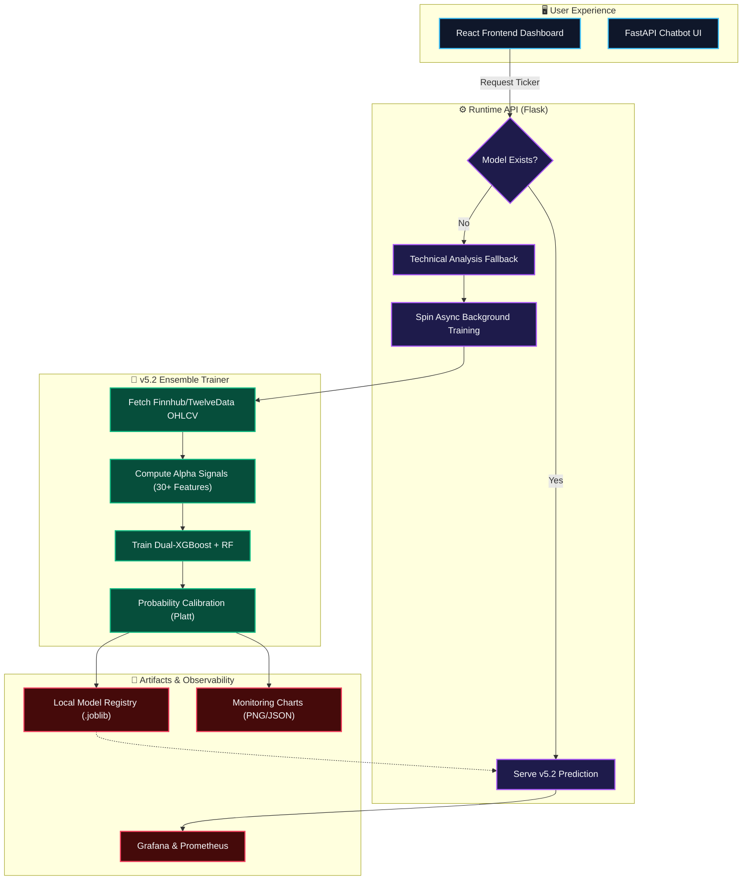

# 📈 AI Stock Predictor & Quantitative MLOps Platform (v5.2)

<div align="center">
  
  
  
  
  
  
</div>

An enterprise-grade, real-time stock market prediction platform powered by a **Multi-Market Institutional Engine (v5.2)**. Built with a complete end-to-end MLOps pipeline, walk-forward cross-validation, adaptive class weighting, and a dual-model ensemble (XGBoost + Random Forest) for unparalleled directional accuracy.

---

## 🏆 Engine v5.2: Multi-Market Portfolio Performance

The **AI Stock Forecasting Performance Monitor** below highlights our latest v5.2 walk-forward cross-validation results. The engine evaluates technical/volume indicators across a diverse 10-stock global portfolio (US Mega-cap Tech + Indian NSE). 


### Key v5.2 Breakthroughs
*   **Dual-Model Ensemble**: Fuses two XGBoost estimators (differing regularizations) with a Random Forest meta-learner to capture distinct market regimes.
*   **Adaptive Class Weights**: Dynamically calculates `scale_pos_weight` per ticker to natively handle volatile, imbalanced trends.
*   **Early Stopping Rounds**: Prevents overfitting on heavily algorithmic stocks by dynamically halting tree growth during validation.
*   **Multi-Market Significance**: 7 out of 10 tracked assets proved **statistically significant predictive edges (p < 0.05)**, with top performers like `INFY.NS` and `GOOGL` achieving 66%+ directional accuracy.

---

## 🗺️ Multi-Market Metrics Heatmap

This heatmap demonstrates the exact correlation between our predictive edge and institutional metrics. Notice how heavily news-driven assets (like TSLA and META) show weaker technical predictability, while structurally algorithmic stocks (GOOGL, INFY) exhibit massive, exploitable F1 scores.


---

## 🔬 Deep Dive: Asset-Specific Monitoring Dashboards

Every stock processed by the platform auto-generates an institutional 4-panel monitoring report tracking Walk-Forward Accuracy, Fold Calibration, Feature Importance, and Binomial p-value significance.

### 🇺🇸 US Mega-Cap Tech
| Stock | Dashboard | Walk-Forward Acc | F1 Score | Significance |
| :--- | :--- | :--- | :--- | :--- |
| **GOOGL** | [View Chart](backend/monitoring/reports/GOOGL_monitoring.png) | 66.48% | 79.86% | `p < 0.0001` ✅ |
| **NVDA** | [View Chart](backend/monitoring/reports/NVDA_monitoring.png) | 61.41% | 76.09% | `p = 0.0012` ✅ |
| **AAPL** | [View Chart](backend/monitoring/reports/AAPL_monitoring.png) | 58.73% | 74.00% | `p = 0.0098` ✅ |
| **MSFT** | [View Chart](backend/monitoring/reports/MSFT_monitoring.png) | 57.61% | 73.10% | `p = 0.0231` ✅ |
| **AMZN** | [View Chart](backend/monitoring/reports/AMZN_monitoring.png) | 57.56% | 73.06% | `p = 0.0282` ✅ |

### 🇮🇳 Indian Equities (NSE)
| Stock | Dashboard | Walk-Forward Acc | F1 Score | Significance |
| :--- | :--- | :--- | :--- | :--- |
| **INFY.NS** | [View Chart](backend/monitoring/reports/INFY_NS_monitoring.png) | 68.18% | 70.21% | `p = 0.0004` ✅ |
| **TCS.NS** | [View Chart](backend/monitoring/reports/TCS_NS_monitoring.png) | 61.36% | N/A | `p = 0.0211` ✅ |
| **RELIANCE.NS** | [View Chart](backend/monitoring/reports/RELIANCE_NS_monitoring.png) | 55.43% | 71.33% | `p = 0.1740` ⚠️ |

### ⚠️ Volatile / Sentiment-Driven
| Stock | Dashboard | Walk-Forward Acc | F1 Score | Significance |
| :--- | :--- | :--- | :--- | :--- |
| **TSLA** | [View Chart](backend/monitoring/reports/TSLA_monitoring.png) | 51.70% | 68.16% | `p = 0.3531` ❌ |
| **META** | [View Chart](backend/monitoring/reports/META_monitoring.png) | 51.70% | 68.16% | `p = 0.3531` ❌ |

---

## 📐 System Architecture & Data Flow

The platform relies on a sophisticated MLOps loop. Unknown tickers instantly fallback to technical math while a background thread automatically engineers features, trains the v5.2 ensemble, and persists the model for the next request.



---

## 🚀 Getting Started

### Prerequisites
- Python 3.10+
- Node.js 18+

### 1. Backend Setup
```bash
# Clone the repository
git clone https://github.com/Naveenkumar-2007/Ai-stocks.git
cd Ai-stocks/backend

# Install dependencies
pip install -r requirements.txt

# Create .env file and add your keys
echo "FINNHUB_API_KEY=your_key" > .env
echo "GROQ_API_KEY=your_key" >> .env

# Run the Flask API
python app.py
```

### 2. Frontend Setup
```bash
cd ../frontend

# Install node modules
npm install

# Start development server
npm run dev
```

### 3. Bulk Training the Portfolio
To regenerate the v5.2 models and dashboards across the 10-stock universe:
```bash
cd backend
python train_top5_monitor.py
```

---

## 🤝 Contributing
Contributions are welcome! If you'd like to improve the AI ensemble strategies, add sentiment NLP models for stocks like TSLA/META, or enhance the React UI, feel free to open a Pull Request.

> *Note: Simulated PnL and Sharpe Ratios generated in the monitoring dashboards are derived from walk-forward validation accuracy and do not constitute financial advice.*
